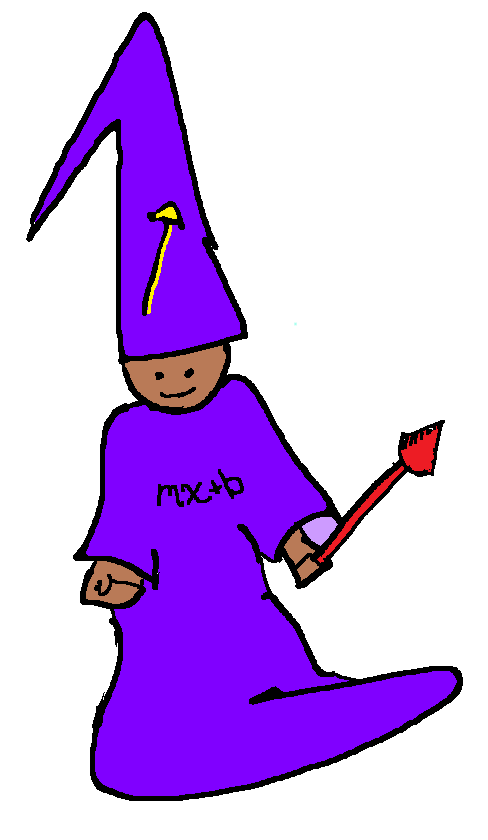
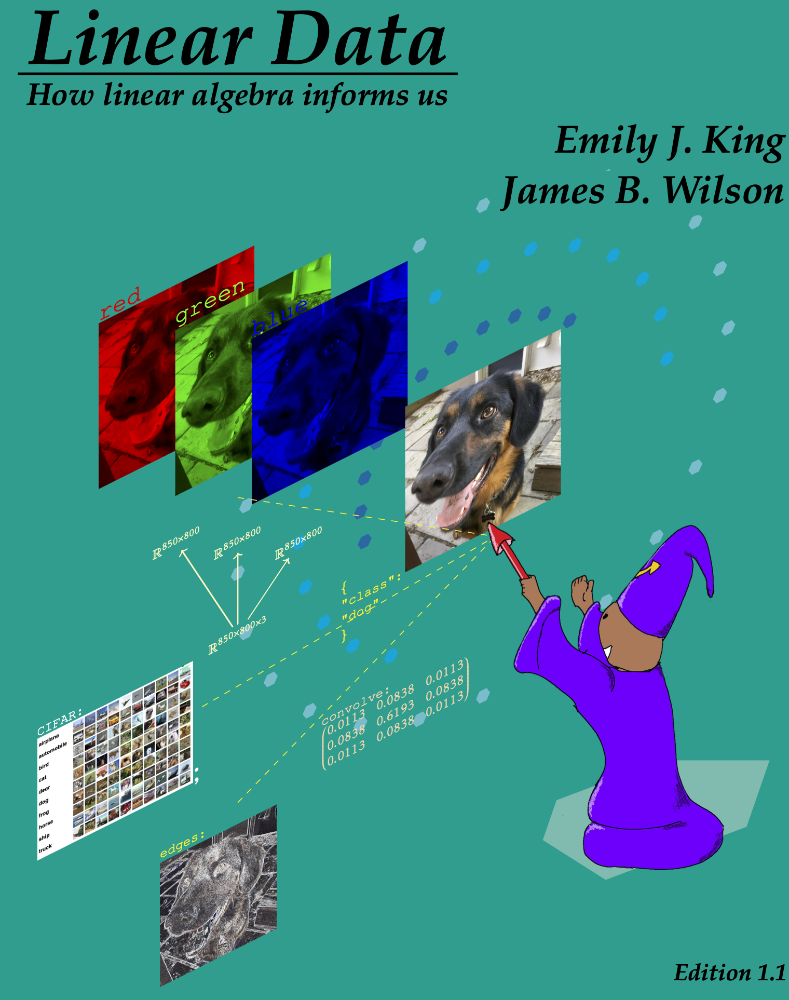
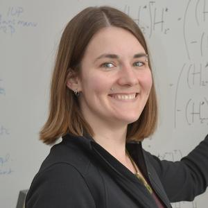
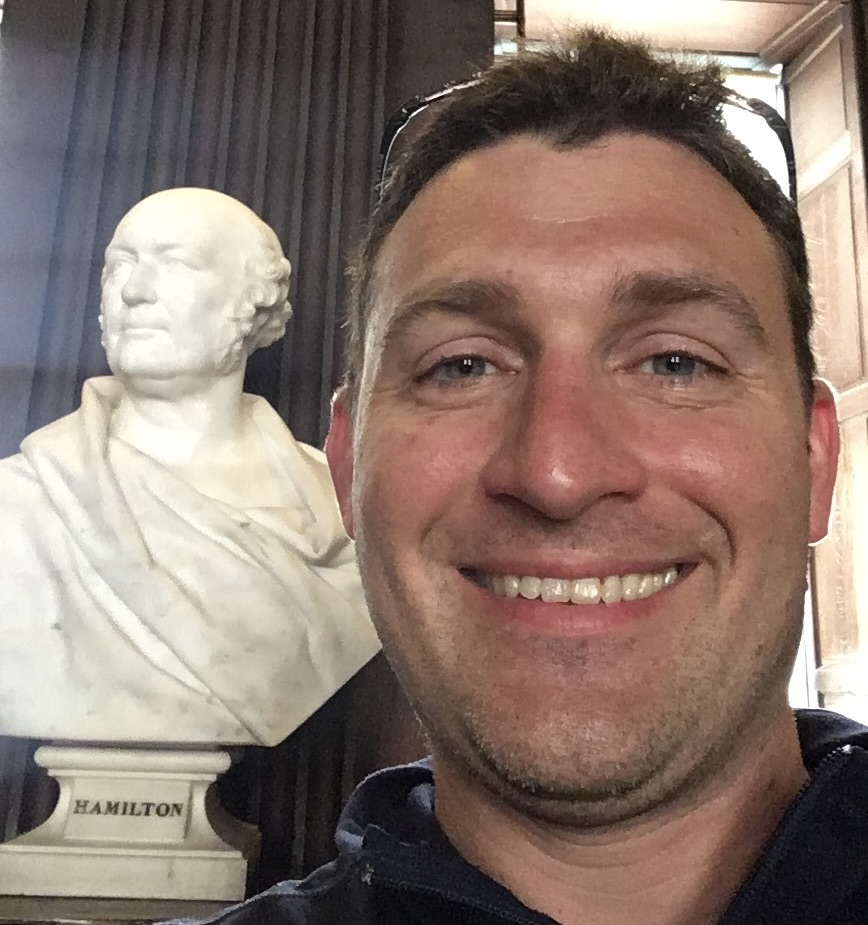

<!-- # Linear Data -->

 Follow Lineum through a journey of daydreams,
magical salads, building a business, and 
national competitions.  Will magic be the key 
for Lineum to conquer big data, or will it come down to math?

Use Lineum's story to launch your own data story.

Emily J. King and James B. Wilson

 
This work is licensed under <a href="http://creativecommons.org/licenses/by-nc/4.0/?ref=chooser-v1" target="_blank" rel="license noopener noreferrer" style="display:inline-block;">CC BY-NC 4.0</a>
 

<iframe width="560" height="315" src="https://www.youtube.com/embed/scaCRHKBMAU?si=kPaPzKzTpalaQFq5" title="YouTube video player" frameborder="0" allow="accelerometer; autoplay; clipboard-write; encrypted-media; gyroscope; picture-in-picture; web-share" allowfullscreen></iframe>

## Book Chapter 1-6

### Meet the Authors

    <h4>Emily J. King</h4> 
    
    <a href="mailto:Emily.King@ColoState.edu">Emily.King@ColoState.edu</a> 
    GitHub <a href="https://github.com/gnikylime">
    @gnikylime</a> 
    

    Department of Mathematics 
    Colorado State University 
    Fort Collins Colorado, USA 
    

    

        

        <a href="https://www.math.colostate.edu/~king/">Dr. Emily King</a> is an Associate Professor in the <a href="https://mathematics.colostate.edu">Department of Mathematics</a> at Colorado State University, hired as part of a data science cluster hire.  Before that, she was a professor at the University of Bremen in Germany, leading the research group Computational Data Analysis. Dr. King is on the editorial board of Scatterplot: the MAA Journal of Data Science and is in general passionate about teaching data science and the mathematics of data science.  Dr. King's research includes data science, (algebraic, geometric, and combinatorial methods in) frame theory, signal &#38; image processing, and pure &#38; applied harmonic analysis. <!--Unlike James, she knows that Hamel bases are not useful in applications outside of mathematics. -->
        

    

 

    <h4>James B. Wilson</h4> 
    
    <a href="mailto:James.Wilson@ColoState.edu">James.Wilson@ColoState.Edu</a> 
    GitHub <a href="https://github.com/algeboy">@algeboy</a> 
    

    Department of Mathematics 
    Colorado State University 
    Fort Collins Colorado, USA 
    

    

        

        <a href="https://www.math.colostate.edu/~jwilson/">James</a> is a Professor of <a href="https://mathematics.colostate.edu">Mathematics</a> at Colorado State University and an affiliate of the <a href="https://www.research.colostate.edu/dsri/">Data Science Research Institute</a>.  James' favorite class is Linear Algebra which he has taught since 2003.  His main research areas are Algebra and Computation, especially the study of tensors.  <!--James prefers his vector spaces to be finite and doubts that all vector spaces have a basis, but has learned to get along with people who imagine otherwise.-->  James has spent more than a decade in research collaborations with industry and government labs and regularly contributes to state-of-the-art mathematical software systems.  James is also on the editorial board of the Journal of Algebra and has been a member or chair of Open Educational Resource committees for more than a decade.  Above he is pictured next to William Rowan Hamilton, the inventor of the "vector" and "tensor".  James is the one in color.
        

    

### License

 
This work is licensed under <a href="http://creativecommons.org/licenses/by-nc/4.0/?ref=chooser-v1" target="_blank" rel="license noopener noreferrer" style="display:inline-block;">CC BY-NC 4.0</a>
 

This license is free to use for any non-commerical work.  
 - **Students** feel free to save a digital copy, or print important portions.  You can even get a full print copy from online print services.
 - **Teachers** feel free to use this text whole or in part for your courses.  Keep in mind this license permits you to mix in chapters and alternatives you prefer for your students. So if you see something you know how to improve, go for it.  And don't be shy to share your success with us, we would love to hear how you reach your students.
 - **For profits** We are dedicated to making ideas accessible to as wide an audience as possible.  If you have an idea to do this that you think requires a business model feel free to contact the authors. But note that our license does not entitle anyone to use this work for profit whole or in part and we are committed to providing free to the public the knowledge that it has invested in creating.

### Thanks

This book was created after years of teaching linear algebra to students of mathematics, 
physics, engineering, computer science, data science, and the arts.  We would like to thank all our students for the combined experiences that continue to contributed to this work.

<!--We also thank Professor Michael Kirby and J. Alexander Hulpke for creating the conditions under which this work could be created.-->
